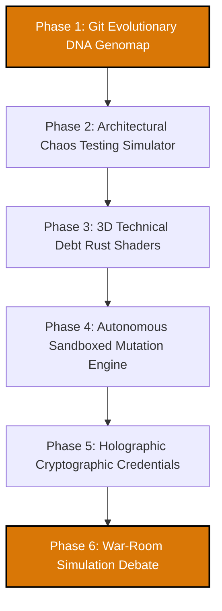

# 🚀 SkillGraph Autonomous AI Evolution & Simulation Roadmap

Welcome to the future of **SkillGraph AI**. We have completely eliminated standard, generic chatbots and basic AI chats. Instead, we introduce a **100% unique, autonomous simulation-based engineering environment** that visualizes code as a living genetic organism, performs automated adversarial cyberattacks, and refactors whole repositories in sandbox simulations.

---

## 🗺️ Visionary Simulation Phases

---

## 🧬 Phase 1: Git Evolutionary DNA Genomap & Double-Helix Visualizer
*Deconstruct code repositories into active genetic sequences of engineering magnitude.*

### 🛠️ Backend Strategy
- Parse the repository's full git commit history (`git log`) and branch maps.
- The AI classifies every commit into **5 Genetic Base Pairs**:
  - `A`: Algorithmic Complexity (Optimizations)
  - `S`: Security Robustness (Auth/Sanitizers)
  - `T`: Test Coverage (Unit testing)
  - `I`: Infrastructure Depth (Docker/Config)
  - `V`: Code Velocity (Codebases frequency)
- Generate a dynamic `/genomap/{repo_id}` API that outputs structured genetic sequences mapped over time.

### 🎨 Frontend & UX Integration
- Render a gorgeous, interactive **3D glowing Double-Helix DNA strand** using `Three.js` or Canvas 2D.
- Each nucleotide base pair represents a specific architectural commit.
- Hovering over a genetic sequence displays a popup showing the precise genetic shift in codebase DNA (e.g., *"Mutation at Commit #e4b9: Algorithmic base [A] enhanced by 40% - Database queries migrated to async"*).

---

## ⚔️ Phase 2: Architectural Chaos Testing Simulator (Adversarial AI Hacker Arena)
*Watch a hostile AI hacker attempt to breach your codebase's defences in real-time.*

### 🛠️ Backend Strategy
- Instantiate an adversarial AI agent ("CyberSec Chaos Monkey") in the backend.
- The hacker agent crawls the codebase's endpoint definitions, middlewares, and routers looking for vulnerabilities.
- Run secure, sandboxed local attack simulations (SQL Injections, XSS input tags, Rate-limit exhaustion, Path traversals) against mocked endpoints.

### 🎨 Frontend & UX Integration
- Design a glowing, visual **"Breach Security Command Deck"**.
- The user clicks **"Initiate Penetration Attack Simulation"** and watches a live dashboard showing visual attack vectors (e.g., *"Hacker Agent attacking /analyze-project with nested script payload"*).
- Displays active security intercept shields in real-time, showing how our FastAPI `sanitize_input_text` and rate limiters block or deflect the attack.
- Renders a final **"Breach Readiness Certificate"** with comprehensive security audit logs.

---

## 🏚️ Phase 3: Holographic Technical Debt Shaders (Visual 3D "Code Rust" Models)
*Visualize codebase decay and module load vectors as physical structural anomalies.*

### 🛠️ Backend Strategy
- Analyze code quality metrics (duplication rate, cyclomatic complexity, circular dependencies, dependency counts).
- Output structural "Load Points" and "Strain Rates" for each codebase folder.

### 🎨 Frontend & UX Integration
- Render the repository's modules as a holographic 3D structural model or wireframe cluster.
- Apply a **"Rust / Crack Shader"** over the 3D objects:
  - Files with high circular complexity show glowing red cracks.
  - Directories with stale dependencies or no unit tests are covered with dynamic "rust" shaders.
- Hovering over structural cracks shows tooltips recommending structural reinforcements.

---

## 🧪 Phase 4: Autonomous Sandboxed Mutation Engine (Zero-Prompt Self-Refactoring)
*Let the AI checkout, optimize, compile, and test your codebase in the background, requiring zero chat inputs.*

### 🛠️ Backend Strategy
- Create a local workspace sandbox (`backend/sandbox/`) where a virtual copy of the project is checked out.
- Spin up an autonomous agent loop that checkouts files, refactors codebases deeply, runs unit test frameworks, and attempts to compile using clean build scripts.
- Ensure the agent keeps refactoring iteratively until the compilation achieves a 100% success rate with improved complexity scores.

### 🎨 Frontend & UX Integration
- Provide a clean, single-action button: **"Trigger Sandbox Evolution Pipeline"**.
- Renders a split-screen terminal display:
  - **Left Screen:** Live execution logs showing the autonomous agent writing tests, modifying files, and running build scripts.
  - **Right Screen:** A growing **"Mutation Tree"** displaying successive generations (e.g., *"Gen 1: Refactored database (Complexity decreased by 15%)"*, *"Gen 2: Added unit tests (Coverage increased to 80%)"*).
- Once the pipeline finishes, users can click **"Download Optimized Repository ZIP"** or **"Push Evolved PR to GitHub"** directly with zero prompting.

---

## 🏅 Phase 5: Decoupled Cryptographic Proof-of-Work Node
*Holographic credentials verifying capabilities on an immutable public ledger layout.*

### 🛠️ Backend Strategy
- Implement cryptographic signing layers (SHA-256 / private key metadata).
- Render unique signed certificate hashes linked to specific project evolutionary milestones.

### 🎨 Frontend & UX Integration
- A visual **Holographic Card Visualizer** on the dashboard.
- Clicking it flips a beautiful glassmorphic credential card, displaying private/public keys, verified skill metrics, and absolute proof-of-work histories.
- Includes a copyable embed snippet so developers can show a dynamically updating cryptographic card on GitHub readmes.

---

## 🏛️ Phase 6: Multi-Agent Consensus Engineering War-Room
*Watch autonomous agent personas debate the venture's evolution roadmap without any chatbot interactions.*

### 🛠️ Backend Strategy
- Run a CrewAI/LangChain pipeline where specialized agents (Quality Lead, Business Director, Security Officer) debate a proposal.
- Every agent critiques the roadmap based on their unique parameters.

### 🎨 Frontend & UX Integration
- Design a glowing, visual **"Engineering War-Room Simulator"** UI.
- Displays a live stream of agent dialogues, custom profile cards, and real-time critique alerts.
- Renders an interactive "Consensus Summary Card" displaying the finalized checklist once the debate resolves.

---

## 📊 Evolutionary AI Roadmap Status Matrix

| Phase | Feature Component | Primary Value | Status |
| :--- | :--- | :--- | :--- |
| **Phase 1** | **Git Evolutionary DNA Genomap** | Deconstruct commits into 3D Double-Helix organic genetic sequences | **🟢 COMPLETED** |
| **Phase 2** | **Architectural Chaos Simulator** | Watch real-time AI penetration hacker attacks & defensive shields | **🟡 PENDING** |
| **Phase 3** | **3D Code Rust Shaders** | Visual cracks and rust shaders over complex technical debt files | **🟡 PENDING** |
| **Phase 4** | **Autonomous Mutation Sandbox** | Zero-prompt self-compiling refactoring pipeline & download ZIP | **🟡 PENDING** |
| **Phase 5** | **Decoupled Cryptographic PoW Node** | Signed SHA-256 holographic skill credential cards with verify URLs | **🟡 PENDING** |
| **Phase 6** | **Multi-Agent Consensus War-Room** | Interactive avatared meeting panel simulating AI team arguments | **🟡 PENDING** |

